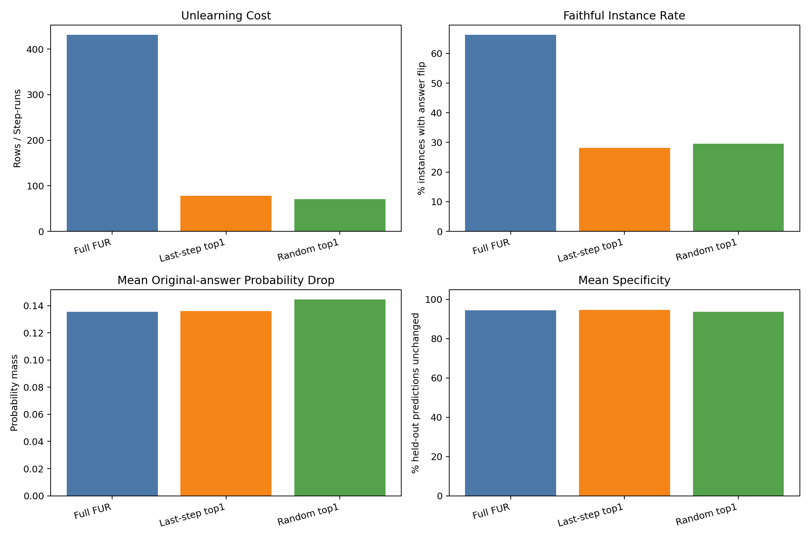
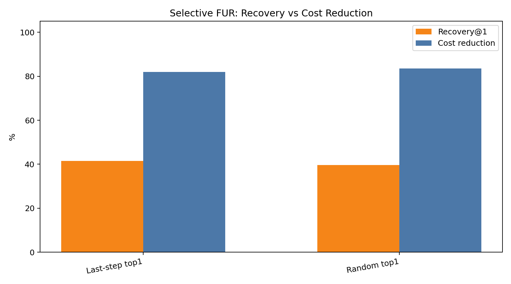
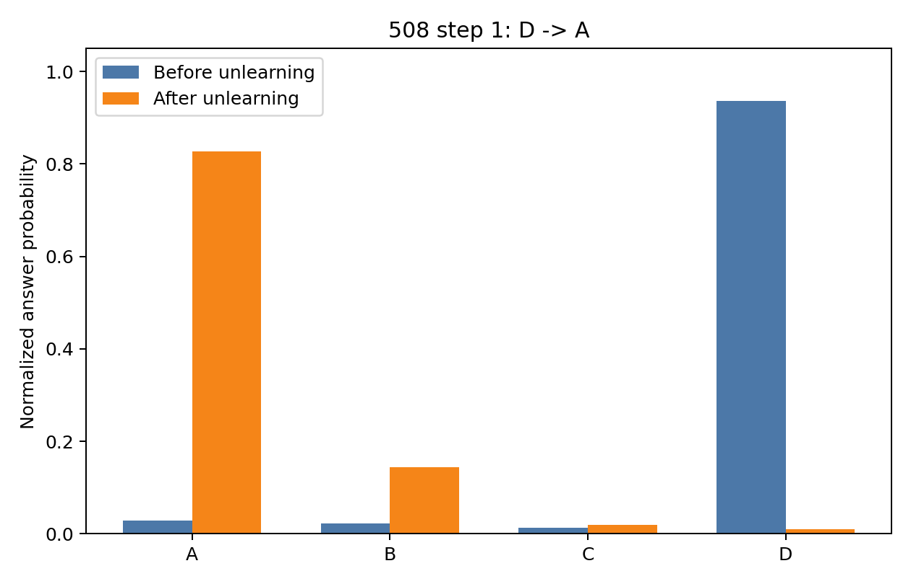
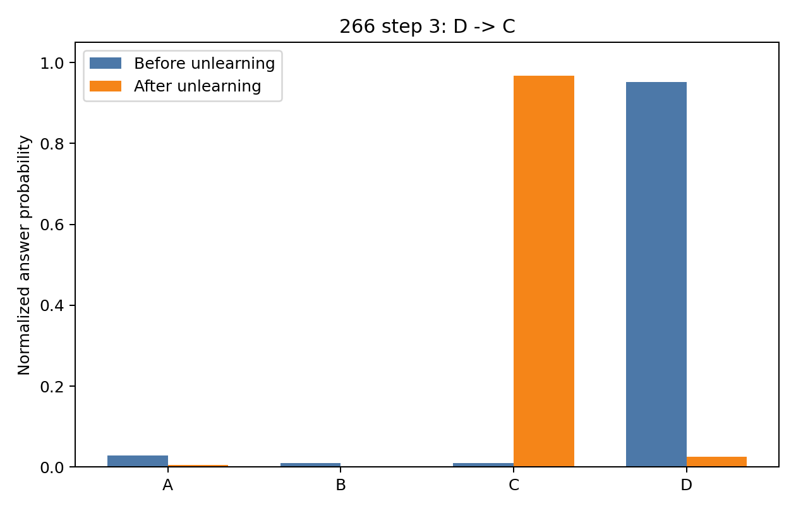
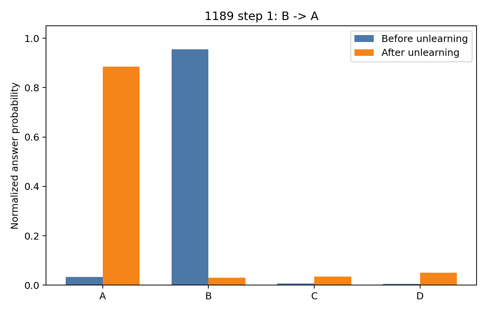
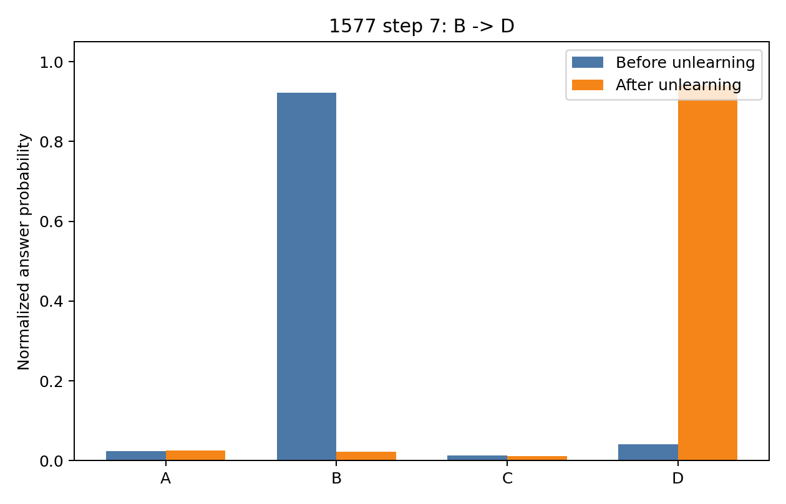
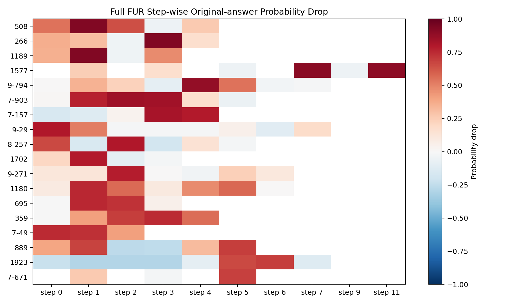
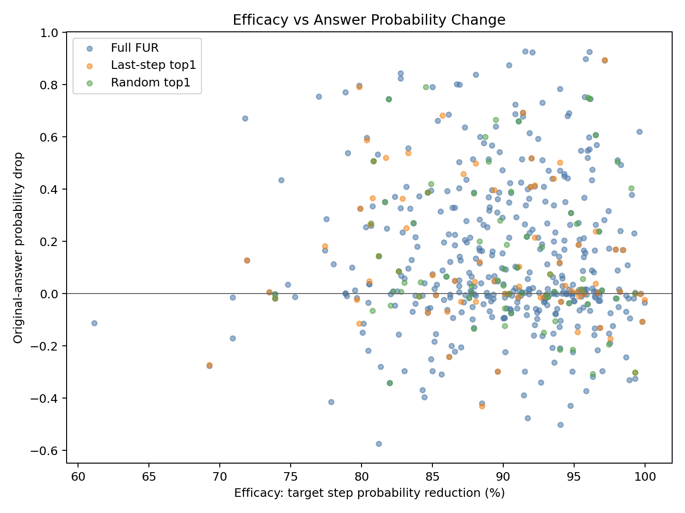

# Enhanced FUR 实验结论与数据分析

## 1. 结论摘要

本次 OpenBookQA + LLaMA-3.2-3B-Instruct 实验表明：

1. **Full FUR 明确能找到大量 faithful reasoning steps。** 在 80 个 instance 中，有 53 个 instance 至少存在一个 step 被 unlearn 后会导致最终答案翻转，faithful instance rate 为 66.25%。
2. **Selective top1 的成本优势很明显。** Last-step top1 只用了 78 次 unlearning，相比 Full FUR 的 431 次减少 81.90%；Random top1 用 71 次，减少 83.53%。
3. **但 naive top1 ranker 的 recall 不够。** Last-step top1 只找回 22/53 个 Full FUR faithful instances，Recovery@1 为 41.51%；Random top1 找回 21/53，Recovery@1 为 39.62%。
4. **Last-step heuristic 没有显著优于 random。** Last-step 的 recovery 略高，但 random 的 selected-step precision 和 per-100-unlearn 效率略高。这说明“只取最后一步”不是一个足够强的 step selector，后续 enhanced 实验需要更强的 verifier/ranker。
5. **Unlearning 本身是有效且相对局部的。** 三组实验的目标 step 概率下降均值约 89%-90%，specificity 保持在 93.7%-94.7%，说明 NPO-KL + FF2 的更新确实能压低目标 step，同时没有明显破坏 held-out prediction。

## 2. 总体结果

| 方法 | Unlearn rows | Instances | Faithful instances | Step flip rate | Mean efficacy | Mean specificity | Mean original-answer drop | Cost reduction |
|:--|--:|--:|--:|--:|--:|--:|--:|--:|
| Full FUR | 431 | 80 | 53 / 80 = 66.25% | 28.31% | 89.94% | 94.51% | 0.1355 | 0.00% |
| Last-step top1 | 78 | 78 | 22 / 78 = 28.21% | 28.21% | 88.96% | 94.74% | 0.1361 | 81.90% |
| Random top1 | 71 | 71 | 21 / 71 = 29.58% | 29.58% | 89.65% | 93.73% | 0.1446 | 83.53% |

完整表格见：

- [table_overall_summary.md](table_overall_summary.md)
- [overall_summary.csv](overall_summary.csv)

总体图：

## 3. Recovery 与成本对比

| 方法 | Selected rows | Full faithful instances | Found faithful instances | Recovery@1 | Coverage | Cost reduction | Step-Hit@1 | Selected step precision | Faithfulness / 100 unlearns |
|:--|--:|--:|--:|--:|--:|--:|--:|--:|--:|
| Last-step top1 | 78 | 53 | 22 | 41.51% | 97.50% | 81.90% | 17.21% | 26.92% | 28.21 |
| Random top1 | 71 | 53 | 21 | 39.62% | 88.75% | 83.53% | 18.85% | 32.39% | 29.58 |

解释：

- **Recovery@1** 使用 Full FUR 的 53 个 faithful instances 作为分母，衡量 selective 方法找回了多少。
- **Step-Hit@1** 使用 Full FUR 中所有会导致答案翻转的 faithful steps 作为分母，衡量 selected step 是否命中这些关键 step。
- **Selected step precision** 使用被 selective 方法选择的 step 作为分母，衡量选中的 step 里有多少在 Full FUR 中也会导致答案翻转。

结论是：top1 selective 的性价比高，但 naive selector 的 recall 明显不足。Last-step top1 用 18.10% 的 unlearning 成本找回 41.51% 的 faithful instances；Random top1 用 16.47% 的成本找回 39.62%。这支持“Selective FUR 可显著降低成本”的方向，但不支持“last step 就是足够好的 ranker”。

对比图：

完整表格见：

- [table_selective_recovery.md](table_selective_recovery.md)
- [selective_recovery_summary.csv](selective_recovery_summary.csv)

## 4. 置信区间

这里对 faithful instance rate 和 step flip rate 给出 Wilson 95% confidence interval：

| 方法 | Faithful instances | Faithful rate | 95% CI | Step flips | Step flip rate | 95% CI |
|:--|:--|--:|:--|:--|--:|:--|
| Full FUR | 53/80 | 66.25% | [55.4, 75.7] | 122/431 | 28.31% | [24.3, 32.7] |
| Last-step top1 | 22/78 | 28.21% | [19.4, 39.0] | 22/78 | 28.21% | [19.4, 39.0] |
| Random top1 | 21/71 | 29.58% | [20.2, 41.0] | 21/71 | 29.58% | [20.2, 41.0] |

Full FUR 的 faithful instance rate 明显高于两个 top1 selective 方法，这是预期的，因为 Full FUR 对每个 instance 尝试多个 step，而 top1 只尝试一个 step。两个 selective 方法的区间高度重叠，因此本实验不能证明 last-step top1 优于 random top1。

完整表格见：

- [table_rate_confidence_intervals.md](table_rate_confidence_intervals.md)

## 5. 概率转移个例

Full FUR 中出现了多个非常显著的 probability mass transfer：unlearning 某个 step 后，原答案概率几乎完全转移到另一个选项。这类样本最能说明模型最终答案确实依赖该 reasoning step。

| ID | Step | Answer change | Correct | Original-answer drop | Before probs | After probs | Question |
|:--|--:|:--|:--|--:|:--|:--|:--|
| 508 | 1 | D -> A | D | 0.9272 | A:0.028 B:0.022 C:0.013 D:0.936 | A:0.828 B:0.144 C:0.019 D:0.009 | To improve health, what is a good strategy? |
| 266 | 3 | D -> C | D | 0.9256 | A:0.029 B:0.011 C:0.009 D:0.951 | A:0.004 B:0.002 C:0.968 D:0.026 | What is used for sensing visual things? |
| 1189 | 1 | B -> A | A | 0.9247 | A:0.033 B:0.955 C:0.007 D:0.005 | A:0.885 B:0.030 C:0.034 D:0.050 | What can feathers on Spheniscidae be used for? |
| 1577 | 7 | B -> D | B | 0.8997 | A:0.025 B:0.922 C:0.013 D:0.041 | A:0.025 B:0.022 C:0.012 D:0.941 | What animal eats plants? |

完整个例表：

- [table_top_probability_transfer_examples.md](table_top_probability_transfer_examples.md)
- [table_strongest_step_examples.md](table_strongest_step_examples.md)
- [table_strongest_instance_examples.md](table_strongest_instance_examples.md)

个例图：

## 6. Step-level 分布

Full FUR 中，431 个 step-run 里有 122 个发生 answer flip，step flip rate 为 28.31%。但这些 step 并不是均匀分布的：80 个 instance 中有 53 个至少有一个 faithful step，且部分 instance 有多个 step 都会触发翻转。

强实例包括：

- `508`：5 个 step 中有 3 个会翻转答案，最大原答案概率下降 0.9272。
- `1577`：6 个 step 中有 2 个会翻转答案，最大原答案概率下降 0.8997。
- `359`：5 个 step 中有 4 个会翻转答案，说明这个样本的 CoT 多处都对最终答案有强支撑。

Step heatmap：

Efficacy 与答案概率变化散点图：

从散点图看，目标 step 的 probability reduction 普遍很高，但高 efficacy 不必然意味着答案翻转；这说明 FUR 中必须同时报告 efficacy 和 answer probability shift，不能只看目标 step 是否被成功遗忘。

## 7. Same-step 对比

对 selective 选中的 step，我们也和 Full FUR 中相同 instance / step 的结果做了对比：

- Last-step top1 中，选中的 step 有 26.92% 在 Full FUR 中也是 faithful step。
- Random top1 中，选中的 step 有 32.39% 在 Full FUR 中也是 faithful step。
- 对命中的 step，同一步在 Full FUR 与 selective rerun 中的 mass shift 通常非常接近，例如 `1577 step 11` 在 Full 中 drop 0.8939，在 last-top1 中 drop 0.8945。

这说明单次 unlearning 的复现实验比较稳定；主要问题不是 unlearning 噪声，而是 step selection 还不够强。

完整表格见：

- [table_selected_vs_full_same_step.md](table_selected_vs_full_same_step.md)
- [selected_vs_full_same_step.csv](selected_vs_full_same_step.csv)

## 8. 实验局限

1. **模型不是 8B。** 本轮因 gated 权重下载限制，使用 LLaMA-3.2-3B-Instruct。结论应表述为 LLaMA-3B 上的 enhanced FUR 结果。
2. **样本规模仍是中等规模。** 本轮是 100 条 CoT、80 个 unlearning target。可以作为完整 pipeline 结果，但若写正式论文，建议扩展到 250 或更多。
3. **Last-step 和 random 都是弱 ranker。** 它们适合作为 selective FUR 的 baseline，不足以作为最终 enhanced 方法。
4. **Sentencize 分割会影响 step 数。** 部分 step 太短会被跳过，因此 selective 的覆盖不是严格 80/80。
5. **Specificity 只使用同数据集 held-out prediction。** 它能检测局部稳定性，但不能完全代表 general capability preservation。

## 9. 建议后续实验

下一步最有价值的增强是加入真正的 step ranker：

1. **Deletion ranker**：删除某个 step，观察固定 CoT 下答案概率变化，选概率变化最大的 step。
2. **Verifier ranker**：训练或调用 verifier 判断每个 step 对最终答案的 support/relevance。
3. **Hybrid ranker**：结合 position prior、answer mention、deletion sensitivity 和 step uncertainty。

建议目标指标：

- 在 cost reduction 仍保持 70%-80% 的情况下，把 Recovery@1 从约 40% 提升到 55%-65%。
- 或者使用 top2 selective，使成本仍小于 Full FUR 的 40%，同时显著提升 Recovery@k。

## 10. 可引用文件

建议报告中优先使用：

- 总体表：[table_overall_summary.md](table_overall_summary.md)
- Recovery 表：[table_selective_recovery.md](table_selective_recovery.md)
- 置信区间表：[table_rate_confidence_intervals.md](table_rate_confidence_intervals.md)
- 概率转移个例表：[table_top_probability_transfer_examples.md](table_top_probability_transfer_examples.md)
- 总体对比图：[overall_metrics_comparison.png](overall_metrics_comparison.png)
- Recovery-cost 图：[recovery_cost_tradeoff.png](recovery_cost_tradeoff.png)
- Step heatmap：[full_fur_step_heatmap_top_instances.png](full_fur_step_heatmap_top_instances.png)
